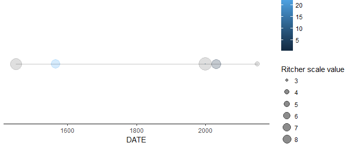

The package `earthquakeGeoms` has been built to clean and display the
earthquake data from NOAA (The National Centers for Environmental
Information). The dataset can be found here:
<https://www.ngdc.noaa.gov/nndc/struts/form?t=101650&s=1&d=1>

The Package is divided into 3 sections:

-   Cleaning the Dataset
-   Displaying the Earthquakes through the geom\_timeline and
    geom\_timeline\_label functions.
-   Displaying the Earthquakes by their geographical location,
    through leaflet.

These 3 sections give you a comprehensive way to analyze and visualize
the Earthquake data.

Cleaning the Dataset
--------------------

The cleaning part of the package is composed 2 functions:

### eq\_location clean

`eq_location_clean` takes an argument `data`, and returns that same data
with its column LOCATION\_NAME cleaned. The cleaning is done by
splitting the character string by the `:` symbol. Then, the latest of
the strings is selected ( the rigth-most string). Finally, the strings
are titled, that is, only the initial letter is uppercase while the rest
remain lowercase (for each word).

    ## Data Setup

    test_dataframe = data.frame(order = 1:10,
                                LOCATION_NAME = c("Peru: Lima", "Mexico: Tijuana",
                                                  "CUBA: HABANA", "SRI LANKA: IslanD",
                                                  "EU: SPain: unknown", "US: Maine",
                                                  "US: California: Los Angeles", " Ecuador: Bogota",
                                                  "Ivory COAST: ISLAND 3", "China: HONG KONG"),
                                stringsAsFactors = F)

    ## Function Call

    test_dataframe = eq_location_clean(test_dataframe)

    test_dataframe

    ##    order LOCATION_NAME
    ## 1      1          Lima
    ## 2      2       Tijuana
    ## 3      3        Habana
    ## 4      4        Island
    ## 5      5       Unknown
    ## 6      6         Maine
    ## 7      7   Los Angeles
    ## 8      8        Bogota
    ## 9      9      Island 3
    ## 10    10     Hong Kong

### eq\_clean\_data

`eq_clean_data` takes an argument `data`, same as `eq_location_clean`,
and returns a cleaned dataset with the `eq_location_clean` applied to
it. Furthermore, the LATITUDE, LONGITUDE, DEATHS, TOTAL\_DEATHS columns
are converted to numeric type. The data points whose YEAR columns is
below 0 (BC years) are removed. The DAY, and MONTH columns have their NA
values converted to 1. Finally, a new DATE column is created by
combining the DAY, MONTH, and YEAR columns and converting them to Date
type.

    ## Data Setup

    test_dataframe = data.frame(LOCATION_NAME = c("Peru: Lima", "Mexico: Tijuana",
                                                  "CUBA: HABANA", "SRI LANKA: IslanD",
                                                  "EU: SPain: unknown", "US: Maine",
                                                  "US: California: Los Angeles"),
                                YEAR = c(2150,-2000,2000,1999,-1610,1566,1450),
                                MONTH = c(NA,3,NA,1,9,6,5),
                                DAY = c(NA,NA,1,4,NA,2,NA),
                                LATITUDE = c(-12.5,20.2,34.1,8.567,36.5,46.975,34.262),
                                LONGITUDE = c(-77,-103.5,-75.5,81.233,-4.4,-66.659,-118.002),
                                DEATHS = c(NA,1,2,8,33,NA,NA),
                                TOTAL_DEATHS = c(NA,1,NA,9,NA,25,NA),
                                stringsAsFactors = F)

    ## Function Call

    test_dataframe = eq_clean_data(test_dataframe) # Calling the function

    test_dataframe

    ##   LOCATION_NAME YEAR MONTH DAY LATITUDE LONGITUDE DEATHS TOTAL_DEATHS
    ## 1          Lima 2150     1   1  -12.500   -77.000     NA           NA
    ## 2        Habana 2000     1   1   34.100   -75.500      2           NA
    ## 3        Island 1999     1   4    8.567    81.233      8            9
    ## 4         Maine 1566     6   2   46.975   -66.659     NA           25
    ## 5   Los Angeles 1450     5   1   34.262  -118.002     NA           NA
    ##         DATE
    ## 1 2150-01-01
    ## 2 2000-01-01
    ## 3 1999-01-04
    ## 4 1566-06-02
    ## 5 1450-05-01

GeomTimeline & GeomTimelineLabel
--------------------------------

The newly created geoms, Geom Timeline & Geom Timeline Label, display
the earthquake data through points of varying color, size, and location
(based on coordinates).

### GeomTimeline

`GeomTimeline` is a new Geom made of pointGrobs and lineGrobs, which
display the input `data` as points. These points vary based on the
colour and size arguments. If a y-axis is given, the points will be
displayed in different y-coordinates. Furthermore, a straight line is
drawn from the minimum x-value to the maximum x-value. If there are
y-coordinates, the line is drawn for each y. This Geom works once it is
called by its layer function `geom_timeline`.

### geom\_timeline

`geom_timeline` is the layer function for the GeomTimeline geom. To call
the Geom, the `data` argument must be supplied. Furthermore, the colour
and size arguments will indicate the color and size of the data points.
If, the y argument is supplied, the data points points will be grouped
into n(y) groups, each displaying its own line of points.

    ## Data Setup

    test_dataframe = data.frame(LOCATION_NAME = c("Peru: Lima", "Mexico: Tijuana",
                                                  "CUBA: HABANA", "SRI LANKA: IslanD",
                                                  "EU: SPain: unknown", "US: Maine",
                                                  "US: California: Los Angeles"),
                                YEAR = c(2150,-2000,2000,1999,-1610,1566,1450),
                                MONTH = c(NA,3,NA,1,9,6,5),
                                DAY = c(NA,NA,1,4,NA,2,NA),
                                LATITUDE = c(-12.5,20.2,34.1,8.567,36.5,46.975,34.262),
                                LONGITUDE = c(-77,-103.5,-75.5,81.233,-4.4,-66.659,-118.002),
                                DEATHS = c(NA,1,2,8,33,NA,NA),
                                TOTAL_DEATHS = c(NA,1,NA,9,NA,25,NA),
                                EQ_PRIMARY = c(4.4,6.5, 8.1, 2.7, 5.5, 6.3, 7.4),
                                stringsAsFactors = F)
    test_dataframe = eq_clean_data(test_dataframe)

    ## Function Call

    ggplot2::ggplot(test_dataframe, ggplot2::aes(DATE,
                                          colour = TOTAL_DEATHS,
                                          size = as.numeric(EQ_PRIMARY) )) +
      geom_timeline() +
      ggplot2::guides(size = ggplot2::guide_legend(title = "Ritcher scale value")) +
      ggplot2::scale_colour_continuous(name = "# of DEATHS") +
      ggplot2::theme_classic()

### GeomTimelineLabel

`GeomTimelineLabel` is a new geom made of lineGrobs and textGrobs, which
label the points from the `data` argument. The location of these labels
are based on the provided `x` argument. The text used to label should be
given as the `label` argument. The textGrob is positioned above the
x-coordinate of the points, right above a vertical line drawn at the
point. If y-coordinates are given, the vertical lines drawn will be
smaller in size, depending on how many unique y-coordinates there are.

### geom\_timeline\_label

`geom_timeline_label` is the layer function to call the
GeomTimelineLabel geom. This label works perfectly with the previously
defined `geom_timeline` function, and inherits its parameters as with
any other ggplot. The extra argument needed is the `label` argument.
Another optional argument used is `nmax`, which describes how many top
labels to use in the annotation. By 'top' label, we ferer to the data
points with the higher `nmax` values based on their `size` attribute.
Note: If you need to provide a size, nmax, or other argument as a single
value, rather than a column of the data, provide it outside the aes
function.

    ## Function Call

    ggplot2::ggplot(test_dataframe, ggplot2::aes(DATE,
                                          colour = TOTAL_DEATHS,
                                          size = as.numeric(EQ_PRIMARY) )) +
      geom_timeline() +
      geom_timeline_label(ggplot2::aes(label = test_dataframe$LOCATION_NAME)) + # Labeling
      ggplot2::guides(size = ggplot2::guide_legend(title = "Ritcher scale value")) +
      ggplot2::scale_colour_continuous(name = "# of DEATHS") +
      ggplot2::theme_classic()

Leaflet Functions
-----------------

The following 2 functions were built to display the earthquake data by
their geographical location through a leaflet map.

### eq\_map

`eq_map` is a function that displays the data points in the input `data`
argument, based on its LATITUDE and LONGITUDE columns. The data points
will be displayed as circles in the map. The second argument,
`annot_col` decides which column in the dataset will be used as the
pop-up annotation of the leaflet map.

**Note: Leaflet Maps may not display in some browsers. To visualize the
results of the leaflet map functions (in vignettes), download the
package and knit the vignette (or preview the html file) in RStudio.**

    ## Data Setup

    ## This is test data (not actual NOAA Locations)
    test_dataframe = data.frame(LOCATION_NAME = c("Mexico: Jalisco",
                                                  "MEXICO:  OAXACA",
                                                  "US: California: Los Angeles"),
                                YEAR = c(2000,1610,1450),
                                MONTH = c(3,NA,5),
                                DAY = c(1,4,NA),
                                LATITUDE = c(20.2,17.0,34.262),
                                LONGITUDE = c(-103.5,-96.3,-118.002),
                                DEATHS = c(1,2,NA),
                                TOTAL_DEATHS = c(1,NA,25),
                                EQ_PRIMARY = c(6.5, 2.7, 7.4),
                                stringsAsFactors = F)
    test_dataframe = eq_clean_data(test_dataframe)

    ## Function Call

    m = eq_clean_data(test_dataframe)

    eq_map(m, annot_col = "DATE")

<!--html_preserve-->

<!--/html_preserve-->
### eq\_create\_label

`eq_create_label` creates a new column called 'popup\_text' from the
LOCATION\_NAME, EQ\_PRIMARY, and TOTAL\_DEATHS columns of the input
argument `data`. The resulting column is a character vector formatted in
HTML-format, where the column LOCATION\_NAME is titled 'Location', the
column 'EQ\_PRIMARY' is titled 'Magnitude', and the column
'TOTAL\_DEATHS' is titled 'Total deaths'. If any of the dataset's rows
is missing either of the column values, then that particular annotation
is skipped in the html string.

    ## Function Call 

    m$popup_text = eq_create_label(m) # Creating the Labels

    ## The locations and coordinates are random (not actual lat and long)
    eq_map(m, annot_col = "popup_text")

<!--html_preserve-->

<!--/html_preserve-->
